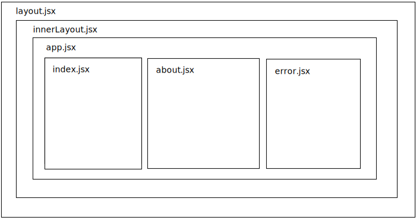

import { Tabs, TabItem } from '@astrojs/starlight/components';

Pages are the main building blocks of your Zuby.js app.
Each page is represented by a file in the `./pages` directory of your Zuby.js app
with the `.jsx` or `.tsx` extension.

Each pages needs to export a default component function that will be rendered by the [JsxProvider](/reference/jsx-provider).
The pages are built for both client and server by default,
so make sure to use only the browser-compatible packages and imports in your page components.

Here's the example of a simple page:
```jsx title="pages/index.jsx"
export default function IndexPage() {
    return (
        <div>
            <h1>Hello world!</h1>
        </div>
    );
}
```

## Page context
The [PageContext](/reference/page-context) is an object that is passed to the page component as `context` prop.
It contain many useful properties that can be used to customize the page component.
Please see the API reference for all available properties.
Here are some examples:

### Retrieving path and params
<Tabs>
    <TabItem label="Javascript">
    ```jsx title="pages/products/[id].jsx"
    export default function Products({ context }) {
        const { id } = context.params;
        const path = context.url.pathname;
        return (
            <div>
              <h1>Product id: {id}</h1>
              <p>Path: {path}</p>
            </div>
        );
    }
    ```
    </TabItem>
    <TabItem label="Typescript">
    ```tsx title="pages/products/[id].tsx"
    import type { PageContext } from 'zuby';

    export default function Products({ context }: { context: PageContext }) {
        const { id } = context.params;
        const path = context.url.pathname;
        return (
            <div>
              <h1>Product id: {id}</h1>
              <p>Path: {path}</p>
            </div>
        );
    }
    ```
    </TabItem>
</Tabs>

### Setting page title
<Tabs>
    <TabItem label="Javascript">
    ```jsx title="pages/about.jsx"
    export default function About({ context }) {
        context.title = 'About us';
        return (
            <div>
                <h1>About us</h1>
                <p>We are a small company that makes websites.</p>
            </div>
        );
    }
    ```
    </TabItem>
    <TabItem label="Typescript">
    ```tsx title="pages/about.tsx"
    import type { PageContext } from 'zuby';

    export default function About({ context }: { context: PageContext }) {
        context.title = 'About us';
        return (
            <div>
                <h1>About us</h1>
                <p>We are a small company that makes websites.</p>
            </div>
        );
    }
    ```
    </TabItem>
</Tabs>

## Page props
The page props are the props that will be passed to the page component.
The props are later used to hydrate the pre-rendered pages on the client.
The props can be passed to the page component from the handlers using the [PageContext](/reference/page-context) object which is passed to page component as `context` prop. \
The handlers are completely separate from the pages,
so you can use static imports and other Node.js features in them.

Example:
<Tabs>
    <TabItem label="Javascript">
    ```jsx title="pages/products/[id].js"

    export default function Handler({ context }) {
        context.props = {
          product: {
            title: 'Book about books',
            description: 'Learn more about books',
            price: 10.99
          }
        };
    }

    ```
    ```jsx title="pages/products/[id].jsx"
    export default function Products({ product, context }) {
        const { id } = context.params;
        const { title, description, price } = product;
        return (
            <div>
              <h1>{title}</h1>
              <p>{description}</p>
              <p>{price}</p>
              <span>{id}</span>
            </div>
        );
    }
    ```
    </TabItem>
    <TabItem label="Typescript">
    ```tsx title="pages/products/[id].ts"
    import type { PageContext } from 'zuby';

    export default function Handler(context: PageContext) {
        context.props = {
          product: {
            title: 'Book about books',
            description: 'Learn more about books',
            price: 10.99
          }
        };
    }

    ```
    ```tsx title="pages/products/[id].tsx"
    import type { PageContext } from 'zuby';

    interface Product {
        title: string;
        description: string;
        price: number;
    }

    interface Props {
        product: Product
        context: PageContext;
    }

    export default function Products({ product, context }: Props) {
        const { id } = context.params;
        const { title, description, price } = product;
        return (
            <div>
              <h1>{title}</h1>
              <p>{description}</p>
              <p>{price}</p>
              <span>{id}</span>
            </div>
        );
    }
    ```
    </TabItem>
</Tabs>

See [Handlers](/guides/handlers) page for more information about handlers.


## Templating
The following special files are available for templating.
All of them are optional and Zuby.js will use the default template if they are not present in the `./pages` directory.
The project can have multiple templates for different routes
and Zuby.js will always try to use the closest template to the page component
that matches the same route.

Templates and pages composition looks like this:



### `app.jsx`
The `app.jsx` file is used to define the main App component of your Zuby.js app.
This the highest-level component in the client-side navigation that can store the state on the client and server.
You should use this component to define the global styles and state providers.

Zuby.js even allows you to have multiple `app.jsx` files for different routes,
however this is not recommended, and it will force to re-render the whole app on each route change.

Every app component must render the `children` prop 
to render the page component.

Example:
```jsx title="pages/app.jsx"

export default function App({ children }) {
    return (
        <div>
            <h1>My Zuby.js app</h1>
            {children}
        </div>
    );
}

```

### `error.jsx`
The `error.jsx` file is used to customize the error page component
on 404, 500 and other errors that are not handled by the page components.
This component will receive the status code and error message as props.
The app can have multiple error templates for different routes.

Example:
```jsx title="pages/error.jsx"
export default function Error({
  statusCode,
  message,
}) {
  return (
    <div>
      <h1>{statusCode}</h1>
      <p>{message}</p>
    </div>
  );
}
```

### `loader.jsx`
The `loader.jsx` file is used to define the loading component that will be shown
between the page transitions on the client when the page is not yet loaded.
The app can have multiple loader templates for different routes.

Example:
```jsx title="pages/loader.jsx"
export default function Loader() {
  return (
    <div>
      <p>Loading...</p>
    </div>
  );
}
```

### `layout.jsx`
The `layout.jsx` file is used to define the default HTML layout for all pages under the given directory.
This component will receive the `app.jsx` component as a `children` prop
and the `context` ZubyPageContext object as a second prop.

The layout component is never built for the client and is only used to render the pages on the server
and for local pre-rendering.

The app can have multiple layout templates for different routes,
however this is not recommended and it can lead to problems with the client-side navigation.

Example:
```jsx title="pages/layout.jsx"
export default function Layout({ children, context }) {
    return (
        <html>
        <head>
          <meta charset="UTF-8" />
          <title>{context.title}</title>
        </head>
        <body>{children}</body>
        </html>
    );
}

```

### `innerLayout.jsx`
The `innerLayout.jsx` file is used to define a component that wraps already rendered app component.
The app can have multiple innerLayout templates for different routes, however this is not recommended.
You should not change the `innerLayout.jsx` file unless you know what you are doing.

### `entry.jsx`
The `entry.jsx` file is used to define the main entry point for your app.
The app can have only one entry template.
You should not change the `entry.jsx` file unless you know what you are doing.